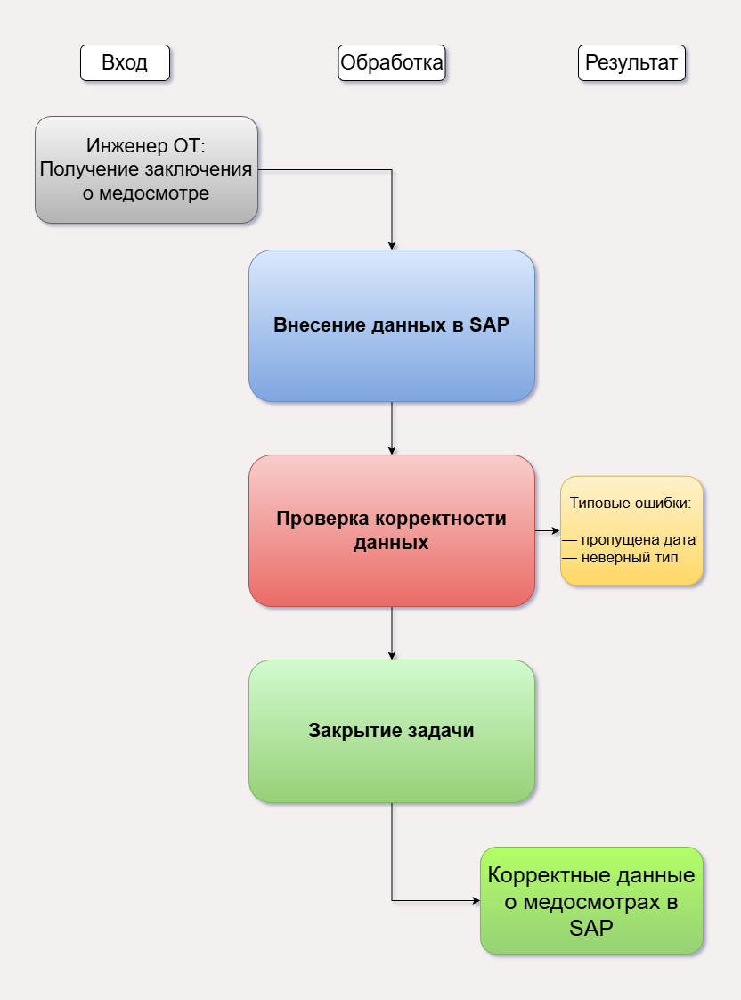

# Документирование процесса SAP HR (медосмотры)

## Задача
Стандартизировать внесение данных о медицинских осмотрах в SAP для 5000+ сотрудников, сократить количество ошибок и время обработки.

## Мои действия
- Собрала функциональные требования от 10+ инженеров по охране труда (бизнес-пользователей).
- Оформила техническое задание для разработчиков IBS: описала алгоритмы, роли, ожидаемый результат.
- Участвовала в согласовании схем взаимодействия и алгоритмов: получала черновые варианты от разработчиков, вносила правки, добивалась соответствия бизнес-логике.
- Проверяла черновую версию инструкции SAP на тестовых данных, выявляла несоответствия, возвращала на доработку.
- После утверждения финальной версии провела обучение для инженеров складов и региональных сотрудников.

## Результат
- Время обработки данных сократилось на 40%
- Количество ошибок при внесении снизилось на 30%
- Инструкция масштабирована на все регионы

## Схема процесса

## Сжатая версия (10 ключевых шагов)
[sap_instruction_short.md](sap_instruction_short.md)
