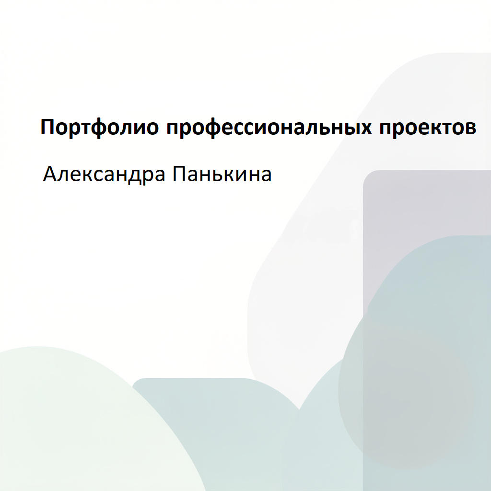

# Александра Панькина — портфолио инженера - технического писателя

## Что я делаю
- Превращаю сложные процессы в понятные инструкции
- Снижаю ошибки пользователей на 25–60%
- Структурирую хаотичную информацию

## Пример работы

## Кейсы
1. [Документирование SAP HR](01-sap-process/README.md)
2. [Улучшение плохой инструкции](02-instruction-rewrite/README.md)
3. [Quick Start Guide для склада](03-quick-start-guide/README.md)
4. [Чек-лист контроля качества](04-checklist/README.md)
5. [Из данных в документацию](05-data-to-documentation/README.md)

**Контакты:** +7 906 062-11-12 | [Email](mailto:** alexandracher@mail.ru)
